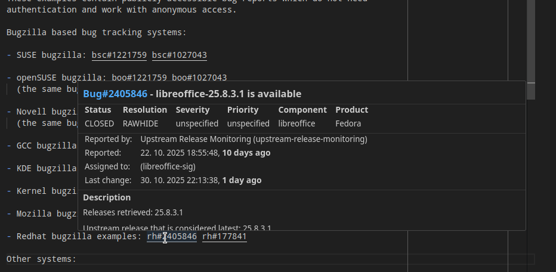
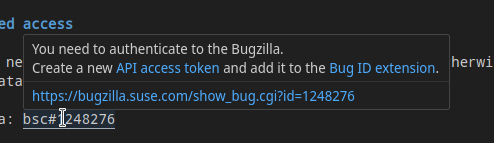
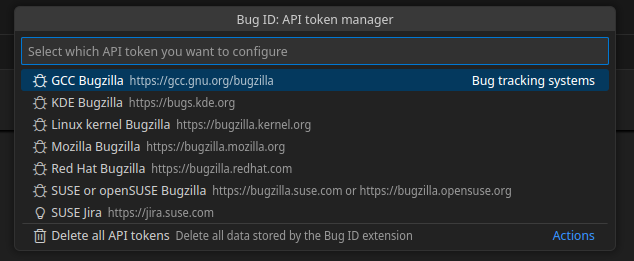

# VSCode Bug ID Extension

This is an extension for the [Visual Studio
Code](https://code.visualstudio.com/) (VSCode) IDE.

It shows bug details when placing the mouse cursor over a bug
identifier.

## Features

- Highlighting of the bug IDs in the text (underlined).
- Displays a tooltip with bug details and a link pointing to the bug
  tracking system to see more details.
- It works in all files, documentation, source code, change logs...

## Supported bug identifiers

| Identifier                 | Bug tracking system                                      | Notes                                                 |
| -------------------------- | -------------------------------------------------------- | ----------------------------------------------------- |
| `gh#<org>/<repo>#<number>` | [GitHub](https://github.com) issues                      |                                                       |
| `bsc#<number>`             | [SUSE Bugzilla](https://bugzilla.suse.com)               | Shared with openSUSE bugzilla                         |
| `boo#<number>`             | [openSUSE Bugzilla](https://bugzilla.opensuse.org)       | Shared with SUSE bugzilla                             |
| `bnc#<number>`             | Novell Bugzilla                                          | Not available anymore, redirects to the SUSE bugzilla |
| `GCC#<number>`             | [GCC Bugzilla](https://gcc.gnu.org/bugzilla)             |                                                       |
| `bko#<number>`             | [Linux Kernel Bugzilla](https://bugzilla.kernel.org)     |                                                       |
| `bmo#<number>`             | [Mozilla Bugzilla](https://bugzilla.mozilla.org)         |                                                       |
| `kde#<number>`             | [KDE Bugzilla](https://bugs.kde.org)                     |                                                       |
| `rh#<number>`              | [Redhat Bugzilla](https://bugzilla.redhat.com)           |                                                       |
| `poo#<number>`             | [openSUSE Progress issue](https://progress.opensuse.org) |                                                       |
| `jsc#<ID>`                 | [SUSE Jira](https://jira.suse.com/)                      |                                                       |
| `CVE-<year>-<number>`      | [NIST vulnerability database](https://nvd.nist.gov)      |                                                       |

For more details see the list of [abbreviations used in
openSUSE](https://en.opensuse.org/openSUSE:Packaging_Patches_guidelines#Current_set_of_abbreviations).

## Authentication

Some systems or bugs can be accessed anonymously without any authentication.
However, authentication might still increase the allowed request rate limit.

### GitHub

Anonymous access to GitHub API allows 60 requests per hour. Limit for the
authenticated requests is 5000 requests per hour.

To authenticate to GitHub click the "Sign in to GitHub" link displayed in the
warning message displayed when reaching the limit for the anonymous requests. Or
you can authenticate anytime by opening the command palette (`Ctrl+Shift+P`) and
selecting the "_Bug ID: Request GitHub authentication_" command. When asked
confirm the access to GitHub for the extension.

### Bugzilla

Bugzilla systems in general allow anonymous access, but some bug reports require
authentication. And some bugs might be accessible only to specific persons or
teams. For example the security bugs might be accessible only to the security
team.

To create an API key and import it to the extension settings just click the
displayed links in a tooltip for a Bugzilla identifier.

Or go to the Bugzilla preferences page, click your account name at the top of
the page and select the "_Preferences_" option. Switch to the "_API KEYS_" tab
and create a new API key. Then open the command palette (`Ctrl+Shift+P`) and
select the "_Bug ID: Manage API tokens_" command. Then select the appropriate
Bugzilla instance in the list and enter the API key.

### SUSE Jira

SUSE Jira requires authenticated access. To create an API key and import it to
the extension settings click the displayed links for a Jira issue identifier.

Alternatively open your user profile page in Jira and select the "_Personal
Access Tokens_" item in the left menu and then click the "_Create token_" button
in the top right corner. Then open the command palette (`Ctrl+Shift+P`) and
select the "_Bug ID: Manage API tokens_" command. Then select the "_SUSE Jira_"
entry in the list and enter the API key.

### NIST CVE

Anonymous access allows 5 requests during 30 seconds. Authenticated access is
not implemented.

## Storing the API tokens

The API tokens are stored in the VSCode using the
[SecretStorage](https://code.visualstudio.com/api/extension-capabilities/common-capabilities#data-storage).
That means the tokens are stored in encrypted form and are not synchronized
across machines. So you have to repeat the token configuration on every machine
you use.

In Linux it uses the GNOME keyring or the KDE kwallet as the storage backend.
See more details in the [VSCode
documentation](https://code.visualstudio.com/api/extension-capabilities/common-capabilities#data-storage)
if you have some troubles with this.

### Token manager

The token manager manages the stored API authentication tokens for various
bug tracking systems. Open the command palette (`Ctrl+Shift+P`) and select the
"_Bug ID: Manage API tokens_" command to start the token manager.

Select a bug tracking system in the list to add or edit its API token. If you
want to delete an API token then use an empty value. To delete all stored API
tokens select the "_Delete all API tokens_" option.

⚠️ _Note: Although the API tokens are stored securely you should still be
careful which applications or extensions you install on your machine. A
malicious app could still access any stored data on your machine._ ⚠️

> [!NOTE]  
> Before uninstalling the extension it is recommended to delete all stored API
> keys. If you do not use the API keys elsewhere then it is also recommended to
> revoke or delete them in the respective systems.
